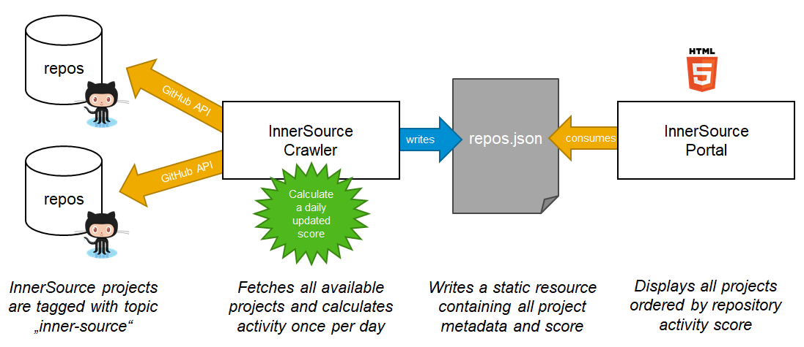

# Crawling

The repository metadata shown in this portal is read from a static `repos.json` file. This project contains a [repos.json](../repos.json) file with mock data for testing and developing purposes.

In a productive environment, consider adding an automated crawler script that fetches all InnerSource projects as outlined in the following picture.

## Step-by-step Crawling Logic


To do so, apply the following steps:

1. Crawl all projects with the topic `inner-source` in your GitHub instance using the [GitHub search API](https://developer.github.com/v3/search/):

   ```
   ?q=topic:inner-source
   ```

   The API returns a list of projects with essential information like name, avatar, description, and statistics that we can enrich with additional fields.

   > *Note:* You can optionally limit the result set by adding `is:public` or `is:private` to the query, depending on how InnerSource repositories are characterized in your environment.

2. For each resulting project add a key ```_InnerSourceMetadata``` to the result from the GitHub API call and fill it with additional metadata about the project:

   * Check if there is a file ```innersource.json``` in the repository and add all keys directly below ```_InnerSourceMetadata```.

   * Query GitHub for the [weekly commit count](https://docs.github.com/en/free-pro-team@latest/rest/reference/repos#get-the-weekly-commit-count) (subset "all") and add it with the key `participation`

   * (Optional) Check if there are contribution guidelines and add the file name with the key `guidelines` (e.g. `CONTRIBUTING.md`). If specified, the *Contribute* button will link directly to the file instead of the repository root.

   * (Optional) Query GitHub [topics](https://docs.github.com/en/rest/reference/repos#get-all-repository-topics) and add the array of topics with the key `topics` for each repo to allow searching projects by topic and displaying them on the detail popup.

   * (Optional) Calculate the [Repository Activity Score](https://github.com/InnerSourceCommons/InnerSourcePatterns/blob/master/patterns/2-structured/repository-activity-score.md) to define a meaningful order for the projects. Sort entries by score descending. Add it with the key `score`

3. Write the resulting list of projects with all metadata to the file ```repos.json``` to serve all projects in the portal.

With this approach, projects can self-register to the portal by adding the ```inner-source``` topic to their repository and specifying additional metadata inside an ```innersource.json``` file.

For more information about this file, see [Listing Project in the Project Portal for InnerSource](CONTRIBUTING.md#listing-project-in-the-project-portal-for-innersource)


## Extra project metadata via `innersource.json`

To provide more details or add a custom logo, add an `innersource.json` file in the root of your repository with the following format:

``` json
{
 "title": "Readable Project Name (optional)",
 "motivation": "A short statement why this project is InnerSource and why contributors should care (optional)",
 "contributions": [
   "List",
   "Of",
   "Requested",
   "Contribtions",
   "Like",
   "Bugfixes",
   "Features",
   "Infrastructure",
   "Documentation",
   "..."
 ],
 "skills": [
   "Skills",
   "Required",
   "To",
   "Contribute",
   "Like",
   "Node.js",
   "Java",
   "C++",
   "..."
 ],
 "logo": "path/to/your/project-logo.png (optional)",
 "docs": "http://url/to/project/documentation (optional)",
 "language": "JavaScript (optional)"
}
```

> *Note:* The property `language` overrides GitHub's [programming language detection](https://docs.github.com/en/github/creating-cloning-and-archiving-repositories/about-repository-languages). Supported values are all entries of type `programming` from the [linguist language list](https://github.com/github/linguist/blob/master/lib/linguist/languages.yml).


## Reference Implementations

*NOTE*: This section needs to be expanded

You will likely have to adapt all of these crawler implementations to your exact setup. However they may still get you off the ground faster than starting from scratch.

* with jq: <TBD SAMPLE HERE>
* with ruby: https://github.com/spier/innersource-crawler-ruby
* with python: https://github.com/zkoppert/innersource-crawler
* as a GitHub Action: ...


## BACKUP from CONTRIBUTING.md

### Listing Project in the Project Portal for InnerSource

1. In your GitHub enterprise instance, add the topic `inner-source` to your repository by clicking on the link "manage topics" below the repository description:
`https://github.yourcompany.corp/<organization>/<repository>`

> **Note:** The portal assumes that a crawler script frequently collects all repositories marked as InnerSource inside your company and compiles a ```repos.json``` file automatically. All data inside this file can be compiled by querying the [GitHub API](https://developer.github.com/v3/) and loading the additional metadata defined in ```innersource.json```. Check the section [Configuration in the README](README.md#configuration) to learn more about crawling InnerSource projects .

2. (Optional) To provide more details or add a custom logo, add an `innersource.json` file in the root of your repository with the following format:

``` json
{
  "title": "Readable Project Name (optional)",
  "motivation": "A short statement why this project is InnerSource and why contributors should care (optional)",
  "contributions": [
    "List",
    "Of",
    "Requested",
    "Contribtions",
    "Like",
    "Bugfixes",
    "Features",
    "Infrastructure",
    "Documentation",
    "..."
  ],
  "skills": [
    "Skills",
    "Required",
    "To",
    "Contribute",
    "Like",
    "Node.js",
    "Java",
    "C++",
    "..."
  ],
  "logo": "path/to/your/project-logo.png (optional)",
  "docs": "http://url/to/project/documentation (optional)",
  "language": "JavaScript (optional)"
}
```

> *Note:* The property `language` overrides GitHub's [programming language detection](https://docs.github.com/en/github/creating-cloning-and-archiving-repositories/about-repository-languages). Supported values are all entries of type `programming` from the [linguist language list](https://github.com/github/linguist/blob/master/lib/linguist/languages.yml).


## BACKUP from README.md

The portal uses a static ```repos.json``` file with mock data for testing and developing purposes. In a productive environment, consider adding an automated crawler script that fetches all InnerSource projects as outlined in the following picture:



To do so, apply the following steps:

1. Crawl all projects with the topic `inner-source` in your GitHub instance using the [GitHub search API](https://developer.github.com/v3/search/):

   ```
   ?q=topic:inner-source
   ```

   The API returns a list of projects with essential information like name, avatar, description, and statistics that we can enrich with additional fields.

   > *Note:* You can optionally limit the result set by adding `is:public` or `is:private` to the query, depending on how InnerSource repositories are characterized in your environment.

2. For each resulting project add a key ```_InnerSourceMetadata``` to the result from the GitHub API call and fill it with additional metadata about the project:

   * Check if there is a file ```innersource.json``` in the repository and add all keys directly below ```_InnerSourceMetadata```.

   * Query GitHub for the [weekly commit count](https://docs.github.com/en/free-pro-team@latest/rest/reference/repos#get-the-weekly-commit-count) (subset "all") and add it with the key `participation`

   * (Optional) Check if there are contribution guidelines and add the file name with the key `guidelines` (e.g. `CONTRIBUTING.md`). If specified, the *Contribute* button will link directly to the file instead of the repository root.

   * (Optional) Query GitHub [topics](https://docs.github.com/en/rest/reference/repos#get-all-repository-topics) and add the array of topics with the key `topics` for each repo to allow searching projects by topic and displaying them on the detail popup.

   * (Optional) Calculate the [Repository Activity Score](https://github.com/InnerSourceCommons/InnerSourcePatterns/blob/master/patterns/2-structured/repository-activity-score.md) to define a meaningful order for the projects. Sort entries by score descending. Add it with the key `score`

3. Write the resulting list of projects with all metadata to the file ```repos.json``` to serve all projects in the portal.

With this approach, projects can self-register to the portal by adding the ```inner-source``` topic to their repository and specifying additional metadata inside an ```innersource.json``` file.

For more information about this file, see [Listing Project in the Project Portal for InnerSource](CONTRIBUTING.md#listing-project-in-the-project-portal-for-innersource)
