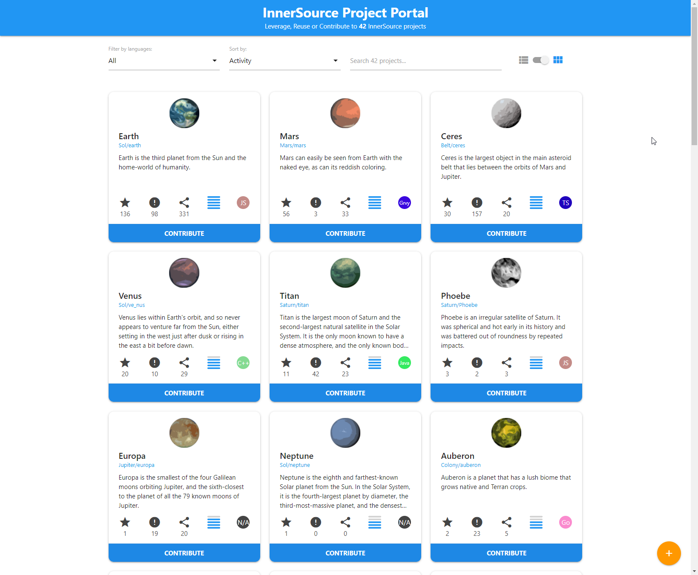

# Project Portal for InnerSource [](https://api.reuse.software/info/github.com/SAP/project-portal-for-innersource)

A reference implementation to list all InnerSource projects of a company in an interactive and easy to use way.
It can be used as a template for implementing the [InnerSource Portal pattern](https://patterns.innersourcecommons.org/p/innersource-portal) by the [InnerSource Commons community](http://innersourcecommons.org/).

## Demo

A running instance of the portal using mock data can be found [here](https://sap.github.io/project-portal-for-innersource/index.html).

The portal can also be seen in action in these recordings:
- [The Unexpected Path of Applying InnerSource Patterns](https://www.youtube.com/watch?v=6r9QOw9dcQo) - InnerSource Commons Fall Summit 2020 session
- [InnerSource & Discoverability](https://youtu.be/Yi2iVMa-gxM) - July 2021 InnerSource Commons Community Call

## Description

Each tile in the project portal represents an InnerSource project. The list of projects can be filtered by programming language, sorted by various KPIs, and searched using a keyword.
Filter and search criteria are persisted in the URL to allow sharing a subset of projects easily. Entries in the portal can be sorted by the [Repository Activity Score](https://patterns.innersourcecommons.org/p/repository-activity-score).



Clicking on the repository URL or the contribute button will take you directly to the source repository for GitHub projects.
Clicking on any other area on the tile will open the details popup with more information on the project.


The "+" button in the lower right explains how to list new projects and how to create the InnerSource metadata file that contains additional information about the project.

## Requirements

Install [nodejs](https://nodejs.org/en/).

## Installation

1. Fork and clone this repository

2. Install nodejs dependencies

``` shell script
npm install
```

> *Note:* a `postinstall` script will place all required framework libraries in the `lib` folder

2. Run the project portal on a local web server

``` shell script
npm start
```

> *Note:* a browser window will open automatically

4. Start developing!

## Running locally via Docker Compose

Presuming you already have [Docker or Docker Desktop installed](https://docs.docker.com/get-docker/), simply:

1. `cd` to the root of this repo
2. Run `docker compose up`

You can then access the service at http://localhost:8080

### Rebuilding and testing locally via Docker Compose

The first time you run `docker compose up`, it will build the image for you, but if you make code changes in this repo and want to test them, you need to rebuild the Docker image via these steps:

1. If running, stop the server by typing `ctrl-c` in the terminal where it is running
2. Run `docker compose build`
3. Type `docker compose up` to relaunch

## Configuration & Crawling

The repository metadata shown in this portal is read from a static `repos.json` file. This project contains a [repos.json](repos.json) file with mock data for testing and developing purposes.

In a productive environment, consider adding an automated crawler script that fetches all InnerSource projects as outlined in the following picture. To build your own crawler please review the [Crawling Documentation](docs/CRAWLING.md).


## Listing Projects

Adding your project to this portal is as easy as adding the `inner-source` topic to your repo. To customize the information about your project that is displayed in the portal, you can optionally add a `innersource.json` file. To see all available options please check the [Listing Documentation](docs/LISTING.md).

## Limitations

The portal focuses on InnerSource projects located in GitHub. Projects using other source code management systems can be displayed in the portal using similar APIs or by adding them manually to the `repos.json` file.  

## Contributing

This project started as an InnerSource project at SAP and is now open source. Your contributions are welcome!
Please check our [contributing guidelines](CONTRIBUTING.md) for more details.

## Thirdparty

We use the following open source frameworks to create the portal:

* [Materialize](https://materializecss.com/)
* [Material-Icons](https://www.npmjs.com/package/material-icons)
* [Moment.js](https://momentjs.com/)
* [Seedrandom](https://github.com/davidbau/seedrandom)

## Acknowledgements

Thank you very much for your internal and external contributions to make this project work:
* [Murugan Varun](https://github.com/varunzxzx)
* [Harish B.](https://github.com/harish-b-0)
* [Michael Graf](https://github.com/michadelic)

Thanks also to [InnerSourceCommons Pattern Group](https://github.com/InnerSourceCommons/InnerSourcePatterns) for the feedback and great support.
