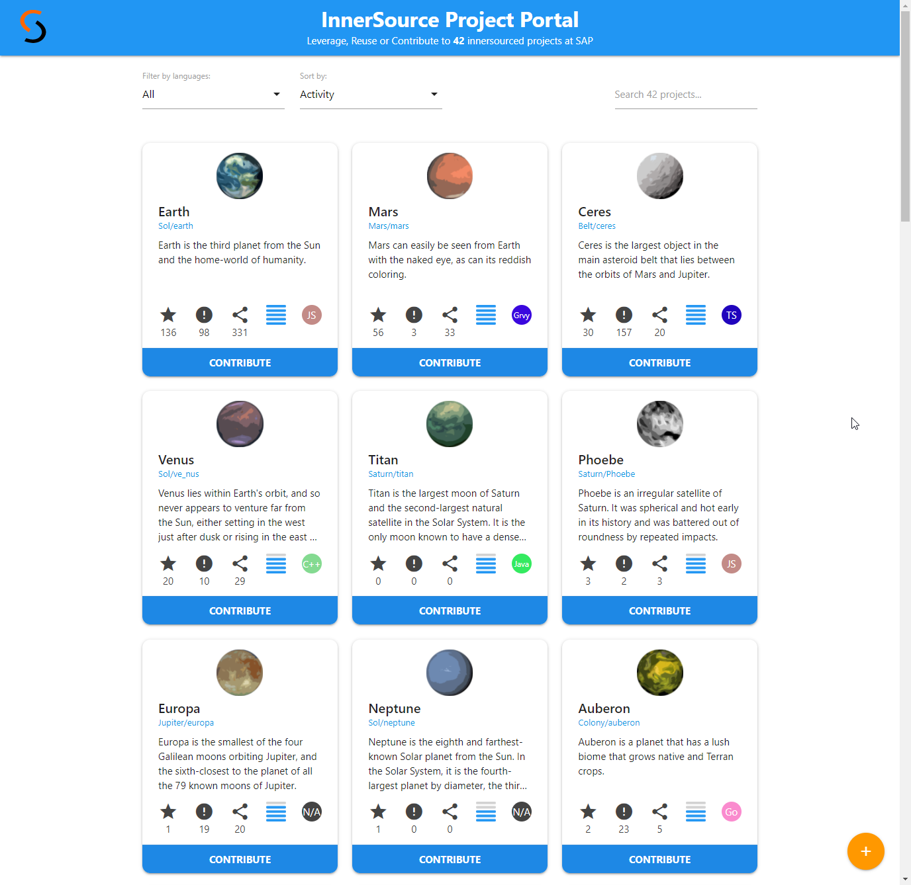
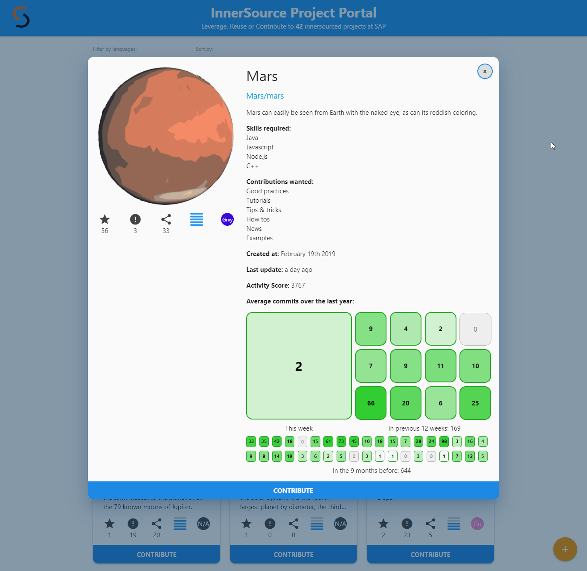

# Project Portal for InnerSource [](https://api.reuse.software/info/github.com/SAP/project-portal-for-innersource)

A reference implementation to list all InnerSource projects of a company in an interactive and easy to use way.
It can be used as a template for implementing the [InnerSource portal pattern](https://github.com/InnerSourceCommons/InnerSourcePatterns/blob/master/patterns/2-structured/innersource-portal.md) by the [InnerSource Commons community](http://innersourcecommons.org/).


## Demo 

A running instance of the portal using mock data can be found [here](https://sap.github.io/project-portal-for-innersource/index.html).

The portal can also be seen in action at the InnerSourceCommons Fall Summit 2020 session [The Unexpected Path of Applying InnerSource Patterns](https://www.youtube.com/watch?v=6r9QOw9dcQo).

## Description

Each tile in the project portal represents an InnerSource project. The list of projects can be filtered by programming language, sorted by various KPIs, and searched using a keyword.
Filter and search criterias are persisted in the URL to allow sharing a subset of projects easily. Entries in the portal can be sorted by the [Repository Activity Score](https://github.com/InnerSourceCommons/InnerSourcePatterns/blob/master/patterns/2-structured/repository-activity-score.md).



Clicking on the repository URL or the contribute button will take you directly to the source repository for GitHub projects.
Clicking on any other area on the tile will open the details popup with more information on the project.



The "+" button in the lower right will explain how to list new projects and how to create the InnerSource metadata file that contains additional information about the project.

## Requirements

Install [nodejs](https://nodejs.org/en/).

## Installation

1. Fork and clone this repository
  
2. Install nodejs dependencies

``` shell script
npm install
```

> *Note:* a `postinstall` script will place all required framework libraries in the `lib` folder

2. Run the project portal on a local web server

``` shell script
npm start
```

> *Note:* a browser window will open automatically

4. Start developing!

## Configuration

The portal uses a static ```repos.json``` file with mock data for testing and developing purposes. In a productive environment, consider adding an automated crawler script that fetches all InnerSource projects as outlined in the following picture:


To do so, apply the following steps:

1. Crawl all projects with the topic `inner-source` in your GitHub instance using the [GitHub search API](https://developer.github.com/v3/search/):

   ```
   ?q=topic:inner-source is:public
   ```

   The API returns a list of projects with essential information like name, avatar, description, and statistics that we can enrich with additional fields.

2. For each resulting project add a key ```_InnerSourceMetadata``` to the result from the GitHub API call and fill it with additional metadata about the project:

   * Check if there is a file ```innersource.json``` in the repository and add all keys directly below ```_InnerSourceMetadata```.

   * Query GitHub for the [weekly commit count](https://docs.github.com/en/free-pro-team@latest/rest/reference/repos#get-the-weekly-commit-count) (subset "all") and add it with key `participation` 

   * Check if there is a file ```CONTRIBUTING.md``` in the repository and add it with the key `guidelines`, value `CONTRIBUTING.md`

   * (Optional) Calculate the [Repository Activity Score](https://github.com/InnerSourceCommons/InnerSourcePatterns/blob/master/patterns/2-structured/repository-activity-score.md) to define a meaningful order for the projects. Sort entries by score descending. Add it with the key `score`

3. Write the resulting list of projects with all metadata to the file ```repos.json``` to serve all projects in the portal.

With this approach, projects can self-register to the portal by adding the ```inner-source``` topic to their repository and specifying additional metadata inside an ```innersource.json``` file.
For more information about this file, see [Listing Project in the Project Portal for InnerSource](CONTRIBUTING.md#listing-project-in-the-project-portal-for-innersource)

## Limitations

The portal focuses on InnerSource projects located in one or more GitHub enterprise instances. Projects using other source code management systems can be displayed in the portal using similar APIs or by adding them manually to the ```repos.json``` file.  

## Contributing

This project started as an InnerSource project at SAP and is now open source. Your contributions are welcome!
Please check our [contributing guidelines](CONTRIBUTING.md) for more details.

## Thirdparty

We use the following open source frameworks to create the portal:

* [jQuery](https://jquery.com/)
* [Materialize](https://materializecss.com/)
* [Material-Icons](https://www.npmjs.com/package/material-icons)
* [Moment.js](https://momentjs.com/)
* [Seedrandom](https://github.com/davidbau/seedrandom)

## Acknowledgements

Thanks to [InnerSourceCommons Pattern Group](https://github.com/InnerSourceCommons/InnerSourcePatterns) for the feedback and great support.
